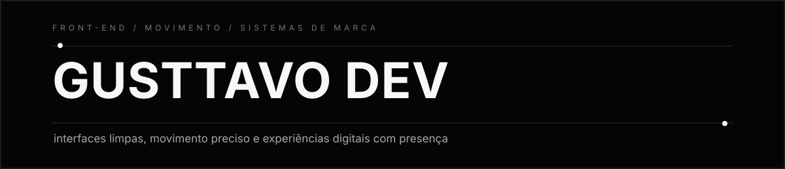
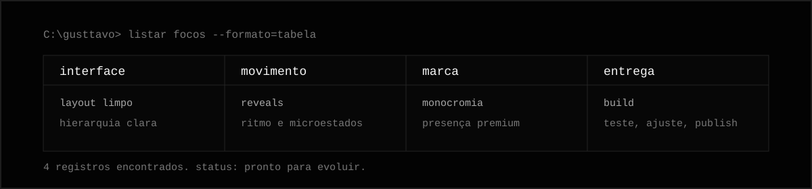
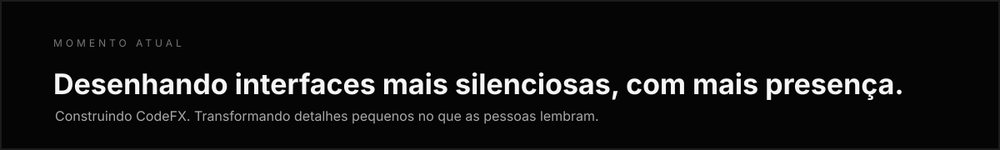

  

  

  <a href="https://github.com/gusttavodev?tab=repositories">projetos</a>
  &nbsp;&nbsp;&nbsp;
  /
  &nbsp;&nbsp;&nbsp;
  <a href="https://github.com/gusttavodev">perfil</a>
  &nbsp;&nbsp;&nbsp;
  /
  &nbsp;&nbsp;&nbsp;
  <a href="https://github.com/gusttavodev?tab=followers">rede</a>

  

<table>
  <tr>
    <td width="58%" valign="top">
      <h3>Direção</h3>
      

        Eu construo experiências front-end com uma linguagem visual limpa, movimento
        preciso e detalhes que fazem uma interface parecer pensada, não apenas montada.
      

      

        Meu trabalho hoje passa por interfaces de produto, páginas com identidade,
        experiências pessoais e o universo CodeFX.
      

    </td>
    <td width="42%" valign="top">
      <h3>Assinatura</h3>
      <pre lang="txt">minimalista primeiro
movimento com propósito
premium sem ruído
detalhes no lugar certo</pre>
    </td>
  </tr>
</table>

  

 

### Stack

  
  
  
  
  

 

### Padrão De Construção

| Superfície | Padrão |
| --- | --- |
| Direção visual | Limpa, contida, premium, nunca genérica. |
| Interação | Hover, clique, foco e movimento precisam parecer fisicamente alinhados. |
| Marca | Preto, branco, cinza, luz, espaçamento e ritmo fazendo trabalho real. |
| Entrega | Construir, testar, refinar e manter a experiência intencional. |

 

### Momento Atual

  

 

  feito com contenção, movimento e atenção demais ao espaçamento

